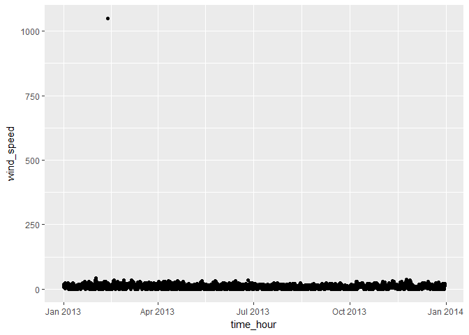
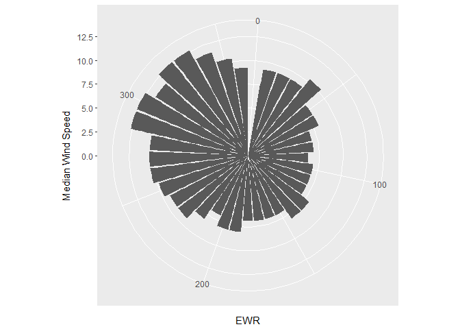
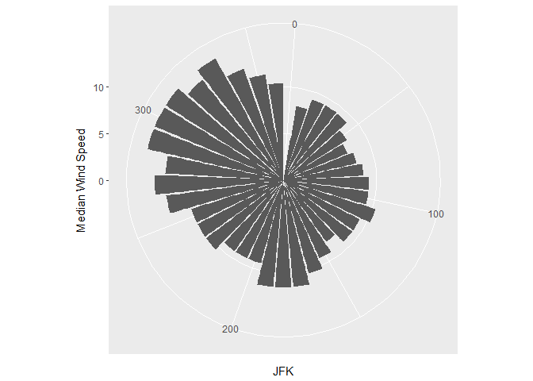
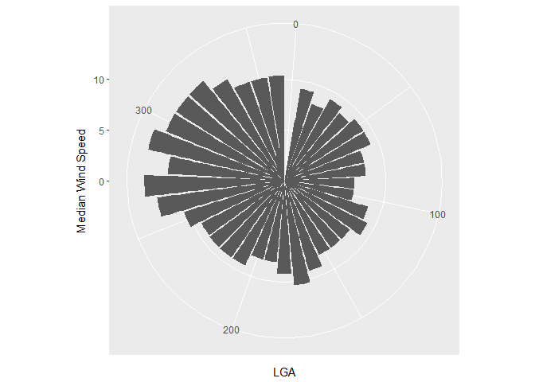
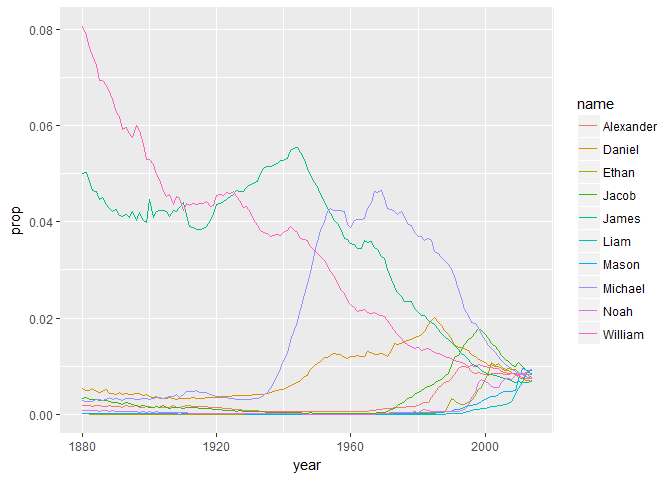
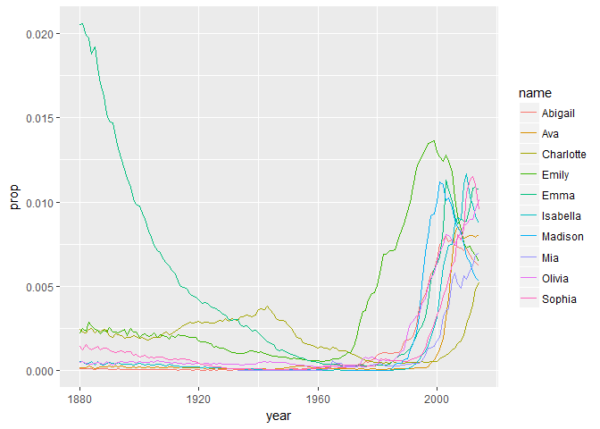
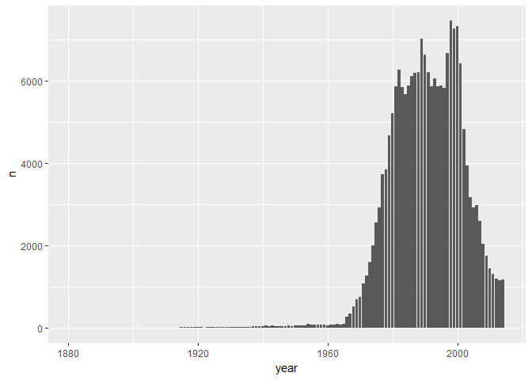

-   Using the nycflights13::weather:

-   Determine whether there are any clear outliers in wind speed (wind\_speed) that should be rejected. If so, filter those bad point(s) and proceed.

``` r
library(dplyr)
```

    ## 
    ## Attaching package: 'dplyr'

    ## The following objects are masked from 'package:stats':
    ## 
    ##     filter, lag

    ## The following objects are masked from 'package:base':
    ## 
    ##     intersect, setdiff, setequal, union

``` r
library(nycflights13)
library(babynames)
library(ggplot2)
library(tidyr)

#Make a data frame tbl for nycflights weather
nyc_flight_weather <- data.frame(nycflights13::weather)


#####find outliers of wind data by visually plotting
ggplot(nyc_flight_weather, aes(time_hour, wind_speed))+
  geom_point()
```

    ## Warning: Removed 3 rows containing missing values (geom_point).



``` r
#removed values that seem unnatural
wind_speed_filtered = nyc_flight_weather %>%
  group_by(wind_speed) %>%
  filter(wind_speed < 200) %>%
  print(wind_speed_filtered)
```

    ## Source: local data frame [26,126 x 15]
    ## Groups: wind_speed [34]
    ## 
    ##    origin  year month   day  hour  temp  dewp humid wind_dir wind_speed
    ##     <chr> <dbl> <dbl> <int> <int> <dbl> <dbl> <dbl>    <dbl>      <dbl>
    ## 1     EWR  2013     1     1     0 37.04 21.92 53.97      230   10.35702
    ## 2     EWR  2013     1     1     1 37.04 21.92 53.97      230   13.80936
    ## 3     EWR  2013     1     1     2 37.94 21.92 52.09      230   12.65858
    ## 4     EWR  2013     1     1     3 37.94 23.00 54.51      230   13.80936
    ## 5     EWR  2013     1     1     4 37.94 24.08 57.04      240   14.96014
    ## 6     EWR  2013     1     1     6 39.02 26.06 59.37      270   10.35702
    ## 7     EWR  2013     1     1     7 39.02 26.96 61.63      250    8.05546
    ## 8     EWR  2013     1     1     8 39.02 28.04 64.43      240   11.50780
    ## 9     EWR  2013     1     1     9 39.92 28.04 62.21      250   12.65858
    ## 10    EWR  2013     1     1    10 39.02 28.04 64.43      260   12.65858
    ## # ... with 26,116 more rows, and 5 more variables: wind_gust <dbl>,
    ## #   precip <dbl>, pressure <dbl>, visib <dbl>, time_hour <dttm>

-   What direction has the highest median speed at each airport? Make a table and a plot of median wind speed by direction, for each airport. Optional fun challenge: If you like, this is a rare opportunity to make use of coord\_polar().

``` r
#####Find direction with highest median speed at each airport

#1) this dataframe shows each airport with the median speed for each direction
median_speed_dir = wind_speed_filtered %>%
  group_by(wind_dir, origin) %>%
  summarise(wind_speed_md = median(wind_speed)) %>%
  group_by(origin, wind_dir) %>%
  summarise(wind_speed_high_med = max(wind_speed_md))

#2) This dataframe shows the max speed of the wind direction for each airport, but I cant get the direction to show
median_speed_dir_location = wind_speed_filtered %>%
  group_by(wind_dir, origin) %>%
  summarise(wind_speed_md = median(wind_speed)) %>%
  group_by(origin) %>%
  summarise(wind_speed_high_med = max(wind_speed_md))

#3) the right way to get the highest median speed, corresponding direction, and location
median_speed = wind_speed_filtered %>%
  group_by(wind_dir, origin) %>%
  summarise(wind_speed_md = median(wind_speed)) %>%
  group_by(origin) %>%
  filter(wind_speed_md == max(wind_speed_md))

print(median_speed)
```

    ## Source: local data frame [10 x 3]
    ## Groups: origin [3]
    ## 
    ##    wind_dir origin wind_speed_md
    ##       <dbl>  <chr>         <dbl>
    ## 1       270    LGA      13.80936
    ## 2       290    EWR      12.65858
    ## 3       290    JFK      14.96014
    ## 4       290    LGA      13.80936
    ## 5       300    EWR      12.65858
    ## 6       300    JFK      14.96014
    ## 7       310    JFK      14.96014
    ## 8       320    EWR      12.65858
    ## 9       330    EWR      12.65858
    ## 10      330    JFK      14.96014

``` r
##EWR is highest at 290,300,320,330 with a speed of 12.65858
## JFK is highest at 290,300,310,330 with a median speed of 14.96014
## LGA is highest at 270 and 290 with a median speed of 13.80936
```

``` r
##### Make a table and a plot of median wind speed by direction, for each airport.
# split to respective airports

#for EWR
EWR = median_speed_dir %>%
  filter(origin == 'EWR')
print(EWR)
```

    ## Source: local data frame [38 x 3]
    ## Groups: origin [1]
    ## 
    ##    origin wind_dir wind_speed_high_med
    ##     <chr>    <dbl>               <dbl>
    ## 1     EWR        0             0.00000
    ## 2     EWR       10             9.20624
    ## 3     EWR       20             9.20624
    ## 4     EWR       30             9.20624
    ## 5     EWR       40            10.35702
    ## 6     EWR       50             8.05546
    ## 7     EWR       60             8.05546
    ## 8     EWR       70             6.90468
    ## 9     EWR       80             6.90468
    ## 10    EWR       90             6.32929
    ## # ... with 28 more rows

``` r
#for JFK
JFK = median_speed_dir %>%
  filter(origin == 'JFK')
print(JFK)
```

    ## Source: local data frame [38 x 3]
    ## Groups: origin [1]
    ## 
    ##    origin wind_dir wind_speed_high_med
    ##     <chr>    <dbl>               <dbl>
    ## 1     JFK        0             0.00000
    ## 2     JFK       10             8.05546
    ## 3     JFK       20             9.20624
    ## 4     JFK       30             9.20624
    ## 5     JFK       40             9.20624
    ## 6     JFK       50             8.05546
    ## 7     JFK       60             7.48007
    ## 8     JFK       70             8.05546
    ## 9     JFK       80             8.63085
    ## 10    JFK       90             9.20624
    ## # ... with 28 more rows

``` r
#for LGA
LGA = median_speed_dir %>%
  filter(origin == 'LGA')
print(LGA)
```

    ## Source: local data frame [38 x 3]
    ## Groups: origin [1]
    ## 
    ##    origin wind_dir wind_speed_high_med
    ##     <chr>    <dbl>               <dbl>
    ## 1     LGA        0             0.00000
    ## 2     LGA       10             9.20624
    ## 3     LGA       20             8.05546
    ## 4     LGA       30             9.20624
    ## 5     LGA       40             8.63085
    ## 6     LGA       50             9.20624
    ## 7     LGA       60             9.20624
    ## 8     LGA       70             8.05546
    ## 9     LGA       80             8.05546
    ## 10    LGA       90             6.90468
    ## # ... with 28 more rows

``` r
#make rose diagram for the wind speeds using ggplot
#EWR plot
ggplot(EWR, aes(wind_dir, wind_speed_high_med))+
  geom_col()+
  coord_polar(theta = "x")+
  xlab('EWR')+
  ylab('Median Wind Speed')
```

    ## Warning: Removed 1 rows containing missing values (position_stack).



``` r
#JFK plot
ggplot(JFK, aes(wind_dir, wind_speed_high_med))+
  geom_col()+
  coord_polar(theta = "x")+
  xlab('JFK')+
  ylab('Median Wind Speed')
```

    ## Warning: Removed 1 rows containing missing values (position_stack).



``` r
#LGA plot
ggplot(LGA, aes(wind_dir, wind_speed_high_med))+
  geom_col()+
  coord_polar(theta = "x")+
  xlab('LGA')+
  ylab('Median Wind Speed')
```

    ## Warning: Removed 1 rows containing missing values (position_stack).



-   Using nycflights13::flights and nycflights13::airlines:

``` r
##### Part 2 using nycflights13 flights and airlines
flights <- nycflights13::flights
airlines <- nycflights13::airlines
```

-   Make a table with two columns: airline name (not carrier code) and median distance flown from JFK airport. The table should be arranged in order of decreasing mean flight distance. Hint: use a \_join function to join flights and airlines.

``` r
#join based on common carrier variable, join and retain only rows with matches
nyc_flights <- inner_join(flights,airlines)
```

    ## Joining, by = "carrier"

``` r
#create table with name and median distance from jfk
name_med_dst = nyc_flights %>%
  filter(origin == 'JFK') %>%
  group_by(name) %>%
  summarise(Median_Dst_JFK = median(distance)) %>%
  arrange(desc(Median_Dst_JFK))
print(name_med_dst)
```

    ## # A tibble: 10 × 2
    ##                        name Median_Dst_JFK
    ##                       <chr>          <dbl>
    ## 1    Hawaiian Airlines Inc.           4983
    ## 2     United Air Lines Inc.           2586
    ## 3            Virgin America           2475
    ## 4      Delta Air Lines Inc.           1990
    ## 5    American Airlines Inc.           1598
    ## 6           JetBlue Airways           1028
    ## 7           US Airways Inc.            541
    ## 8         Endeavor Air Inc.            427
    ## 9                 Envoy Air            425
    ## 10 ExpressJet Airlines Inc.            228

-   Make a wide-format data frame that displays the number of flights that leave Newark ("EWR") airport each month, from each airline

``` r
##### make a wide format data frame that displays the number of flights that leave Newark ("EWR") airport each month, from each airline. I could put month as rownames, but do i need to?
wide = nyc_flights %>%
  group_by(month, name) %>%
  summarise(month.2013 = length(month)) %>%
  spread(name, month.2013)
print(wide)
```

    ## Source: local data frame [12 x 17]
    ## Groups: month [12]
    ## 
    ##    month `AirTran Airways Corporation` `Alaska Airlines Inc.`
    ## *  <int>                         <int>                  <int>
    ## 1      1                           328                     62
    ## 2      2                           296                     56
    ## 3      3                           316                     62
    ## 4      4                           311                     60
    ## 5      5                           325                     62
    ## 6      6                           252                     60
    ## 7      7                           263                     62
    ## 8      8                           263                     62
    ## 9      9                           255                     60
    ## 10    10                           236                     62
    ## 11    11                           202                     52
    ## 12    12                           213                     54
    ## # ... with 14 more variables: `American Airlines Inc.` <int>, `Delta Air
    ## #   Lines Inc.` <int>, `Endeavor Air Inc.` <int>, `Envoy Air` <int>,
    ## #   `ExpressJet Airlines Inc.` <int>, `Frontier Airlines Inc.` <int>,
    ## #   `Hawaiian Airlines Inc.` <int>, `JetBlue Airways` <int>, `Mesa
    ## #   Airlines Inc.` <int>, `SkyWest Airlines Inc.` <int>, `Southwest
    ## #   Airlines Co.` <int>, `United Air Lines Inc.` <int>, `US Airways
    ## #   Inc.` <int>, `Virgin America` <int>

-   Using the babynames dataset:

``` r
##### Use the babynames dataset
baby_names <- babynames::babynames
```

-   Identify the ten most common male and female names in 2014. Make a plot of their frequency (prop) since 1880. (This may require two separate piped statements).

Make a table with the top 10 girls and boys names for 2014

``` r
##### Identify the ten most common male and female names in 2014. Make a plot of their frequency (prop) since 1880. (This may require two separate piped statements).

# make a table with top 10 girl and boy names for 2014
top_ten = baby_names %>%
  filter(year == 2014) %>%
  group_by(sex) %>%
  top_n(10,n) %>%
  select(year, sex, name)
print(top_ten)
```

    ## Source: local data frame [20 x 3]
    ## Groups: sex [2]
    ## 
    ##     year   sex      name
    ##    <dbl> <chr>     <chr>
    ## 1   2014     F      Emma
    ## 2   2014     F    Olivia
    ## 3   2014     F    Sophia
    ## 4   2014     F  Isabella
    ## 5   2014     F       Ava
    ## 6   2014     F       Mia
    ## 7   2014     F     Emily
    ## 8   2014     F   Abigail
    ## 9   2014     F   Madison
    ## 10  2014     F Charlotte
    ## 11  2014     M      Noah
    ## 12  2014     M      Liam
    ## 13  2014     M     Mason
    ## 14  2014     M     Jacob
    ## 15  2014     M   William
    ## 16  2014     M     Ethan
    ## 17  2014     M   Michael
    ## 18  2014     M Alexander
    ## 19  2014     M     James
    ## 20  2014     M    Daniel

``` r
#top ten for girls
top_ten_girl = baby_names %>%
  filter(year == 2014) %>%
  filter(sex == 'F') %>%
  top_n(10,n)

#top ten for girls
top_ten_boy = baby_names %>%
  filter(year == 2014) %>%
  filter(sex == 'M') %>%
  top_n(10,n)
```

Organize data into tables of frequency from 1880 for boys and girls of top ten names in 2014

``` r
#table to plot name by frequency from 1880 for girls top 10 from 2014
name_plot_girl <- baby_names %>%
  filter(sex == 'F') %>%
  filter(name %in% top_ten_girl$name) %>%
  select(year,sex,name,prop) %>%
  group_by(name)
  
#table to plot name by frequency from 1880 for boys top 10 from 2014
name_plot_boy <- baby_names %>%
  filter(sex == 'M') %>%
  filter(name %in% top_ten_boy$name) %>%
  select(year,sex,name,prop) %>%
  group_by(name)
```

Plot the boys frequency plot

``` r
#boys top 10 frequency plot since 1880
ggplot(name_plot_boy, aes(year, prop, color = name))+
  geom_line()
```



Plot the girls frequency plot

``` r
#girls top 10 frequency plot since 1880
ggplot(name_plot_girl, aes(year, prop, color = name))+
  geom_line()
```



-   Make a single table of the 26th through 29th most common girls names in the year 1896, 1942, and 2016

``` r
##### Make a single table of the 26th through 29th most common girls names in the year 1896, 1942, and 2016
#Note 2016 doesnt exist in the dataset

#make a table for females in 1896
common_names_1896 <- baby_names %>%
  select(year, sex, name, n) %>%
  filter(sex == 'F') %>%
  filter(year == 1896)
#make a table for females in 1942
common_names_1942 <- baby_names %>%
  select(year, sex, name, n) %>%
  filter(sex == 'F') %>%
  filter(year == 1942)
#make a table for females in 2014 since 2016 isnt on the original dataframe
common_names_2014 <- baby_names %>%
  select(year, sex, name, n) %>%
  filter(sex == 'F') %>%
  filter(year == 2014)

#join the three tables together
common_names_join = full_join(common_names_1896, common_names_1942)
```

    ## Joining, by = c("year", "sex", "name", "n")

``` r
common_names = full_join(common_names_join, common_names_2014)
```

    ## Joining, by = c("year", "sex", "name", "n")

``` r
#chooses the 26-29 most popular names of girls for the three years
names_26_29 = common_names %>%
  group_by(year) %>%
  top_n(29,n) %>%
  top_n(-4,n)
print(names_26_29)
```

    ## Source: local data frame [12 x 4]
    ## Groups: year [3]
    ## 
    ##     year   sex     name     n
    ##    <dbl> <chr>    <chr> <int>
    ## 1   1896     F   Martha  2022
    ## 2   1896     F   Esther  1964
    ## 3   1896     F  Frances  1964
    ## 4   1896     F    Edith  1932
    ## 5   1942     F    Helen 10014
    ## 6   1942     F  Marilyn  9904
    ## 7   1942     F    Diane  9550
    ## 8   1942     F   Martha  9513
    ## 9   2014     F Brooklyn  6767
    ## 10  2014     F     Lily  6727
    ## 11  2014     F   Hannah  6512
    ## 12  2014     F    Layla  6428

-   Write task that involves some of the functions on the Data Wrangling Cheat Sheet and execute it. You may either use your own data or data packages (e.g., the ones listed here).

Make a plot of my name 'Jared' of number of usage over time in years

``` r
#make a graph of number of occurrence per year of males with my name
my_name = baby_names %>%
  filter(name == 'Jared') %>%
  filter(sex == 'M')

ggplot(my_name, aes(year,n))+
  geom_bar(stat = "identity")
```


